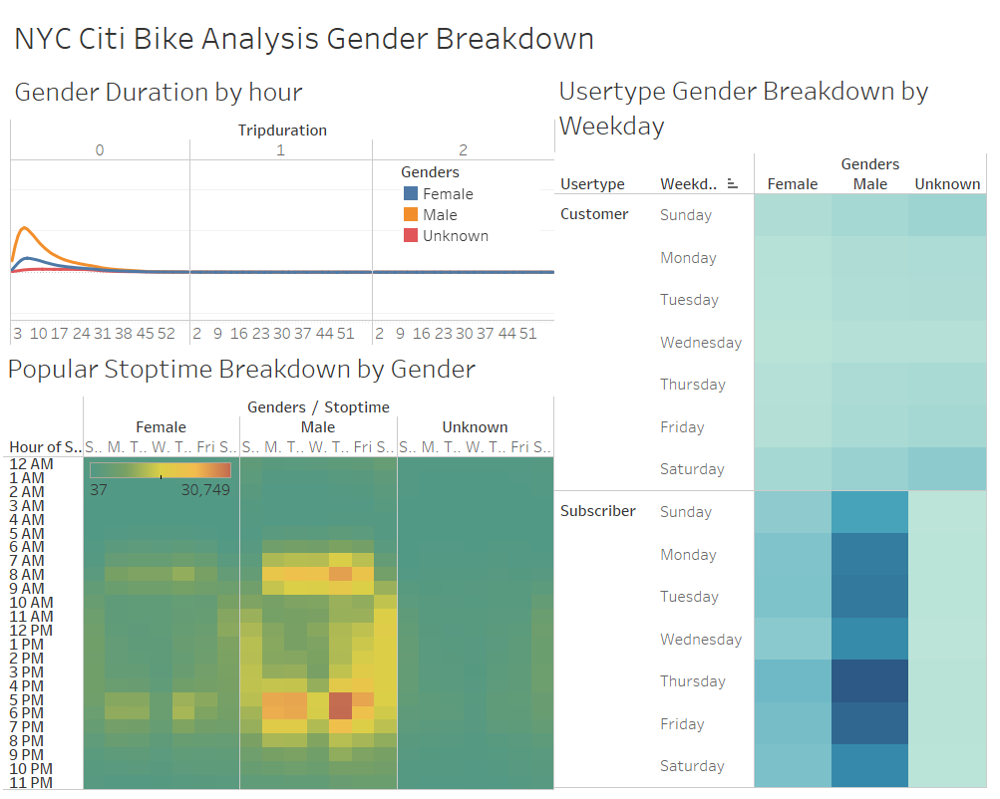
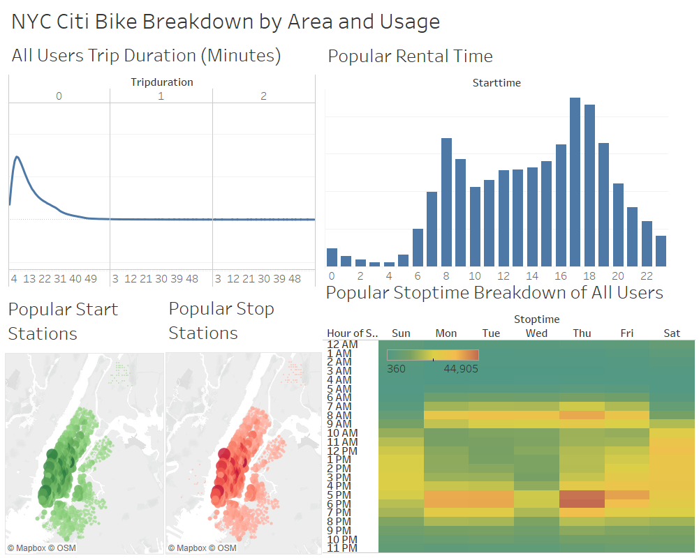

# Citi Bike Data Breakdown
_____________________________
# Link to the Tableau Public Analysis: [Link to Story](https://public.tableau.com/views/Buch_Citi_Bike_Data_Breakdown/Story1?:language=en-US&publish=yes&:display_count=n&:origin=viz_share_link)

## Background

This analysis was conducted to evaluate the bike usage data for New York City. The data was broken down based on gender and usage to determine the largest groups currently involved with bike rentals, and where they tend to operate the most. Tableau was utilized to display this data and determine the results of this analysis.

## Results

### * Gender

* Three visualizations were included for the gender breakdown: THe trip duration (in minutes) by gender, the popular stop times (by week day) by gender, and the user type broken down by week day and gender.

* The results indicated that males were the largest user group, utilizing the bikes more often and for longer trips. The most popular days for bike rentals occured on the weekdays, with the most bikes returned between the hours 5pm and 6pm. Females showed similar trends to males, but at a much lower frequency. Subscribers were overwhelmingly the most common user, with males using the bike rentals the most during weekdays.

### * Overall Usage

* Five visualizations were included for the usage analysis: the total trip duration (in minutes) for all users, the most popular rental start time for all users, the most popular start and stop locations for all users, and the most popular stop times (by week day) for all users.

* The results indicated that the most commone locations for starting and stopping rentals occured within the city center, with decreasing frequency of rentals occuring farther from the city center. The most popular start times for a rental occured between 8am and 7pm, with notable spikes in activity at 8am and between 5pm and 7pm. The most popular rental days overall were during the weekdays, with the most rentals ending around 5pm to 6pm. Total trip durations were largely less than an hour, with a small portion extending 2 to 3 hours and beyond.

## Summary

The data indicates that the city center is the most popular region for bike rentals, with males as the largest user group. The most common times to begin a rental begin around 8am and continue through the day to 7pm, with more rentals occuring during the weekdays. 

If more rental stations were to be introduced, the data indicates that they should be focused in downtown New York, with more rental opportunities available during the workday Monday through Friday.

If further visual anayises were to be conducted, it is recommended that the most common locations based on gender are determined. In addition, the most common times to start and stop rentals based on gender. These would allow a better understanding of the user base and where to distribute male and female bikes.

